# SkillPulse — End-to-End DevOps CI/CD Project

A production-style three-tier skill-tracking application demonstrating Docker, GitHub Actions, a self-hosted runner, Kubernetes, KinD, Nginx, Go, and MySQL.


## Project Overview

SkillPulse allows users to add technical skills, log learning sessions, set goals, and track progress. The project demonstrates the complete software delivery lifecycle: development, containerization, CI image builds, automated deployment, Kubernetes orchestration, validation, and troubleshooting.

## Architecture

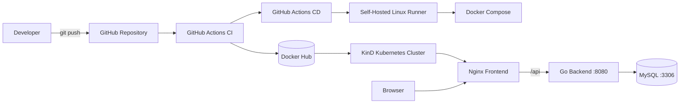
```mermaid
flowchart LR
  Dev[Developer] -->|git push| GitHub[GitHub Repository]
  GitHub --> CI[GitHub Actions CI]
  CI --> Registry[(Docker Hub)]
  CI --> CD[GitHub Actions CD]
  CD --> Runner[Self-Hosted Linux Runner]
  Runner --> Compose[Docker Compose]
  Registry --> Kind[KinD Kubernetes Cluster]
  Kind --> Frontend[Nginx Frontend]
  Frontend -->|/api| Backend[Go Backend :8080]
  Backend --> MySQL[(MySQL :3306)]
  User[Browser] --> Frontend
```

## Technology Stack

| Component | Technology |
|---|---|
| Frontend | HTML/CSS/JavaScript served by Nginx |
| Backend | Go REST API |
| Database | MySQL 8 |
| Containerization | Docker and Docker Compose |
| CI/CD | GitHub Actions |
| Deployment runner | Self-hosted Linux runner |
| Orchestration | Kubernetes on KinD |
| Registry | Docker Hub |

## Repository Structure

```text
skillpulse/
├── .github/workflows/
│   ├── ci.yml
│   ├── cd.yml
│   ├── deploy.yml
│   └── cd-k8s.yml
├── backend/
├── frontend/
│   ├── Dockerfile
│   └── nginx.conf
├── mysql/
├── k8s/
│   ├── 00-namespace.yaml
│   ├── 10-mysql.yaml
│   ├── 20-backend.yaml
│   ├── 30-frontend.yaml
│   ├── backend-service.yaml
│   ├── docker-compose.yml
│   └── kind-config.yaml
├── .env.example
├── .gitignore
├── docker-compose.yml
├── Makefile
└── README.md
```

## Prerequisites

```bash
git --version
docker --version
docker compose version
kubectl version --client
kind version
```

## Environment Setup

```bash
cp .env.example .env
nano .env
```

```env
DB_HOST=database
DB_PORT=3306
DB_USER=root
DB_PASSWORD=change-me
DB_NAME=skillpulse
DOCKERHUB_USERNAME=your-dockerhub-username
```

Never commit credentials. Confirm that `.env` is ignored:

```bash
git check-ignore -v .env
git status
```

## Local Deployment with Docker Compose

### Build and start

```bash
docker compose up -d --build
```

This builds the frontend and backend images, starts MySQL, waits for its health check, and starts the complete stack.

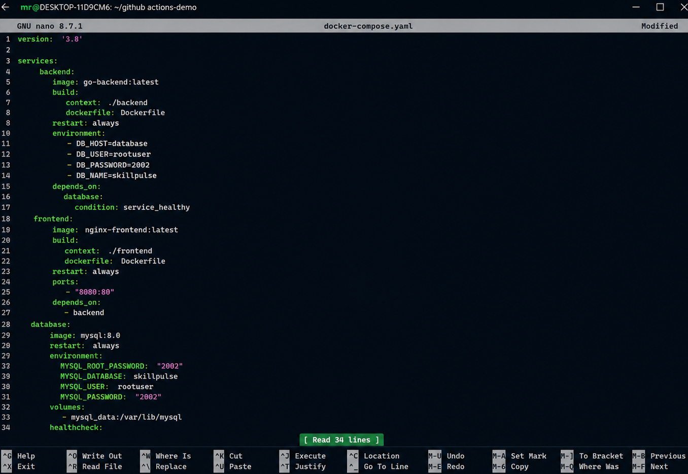

### Verify services

```bash
docker compose ps
docker ps
```

Expected services:

```text
database   mysql:8.0             healthy
backend    skillpulse-backend    running
frontend   skillpulse-frontend   running
```

### Check logs

```bash
docker compose logs -f database
docker compose logs -f backend
docker compose logs -f frontend
```

Open the application:

```text
http://localhost:8080
```

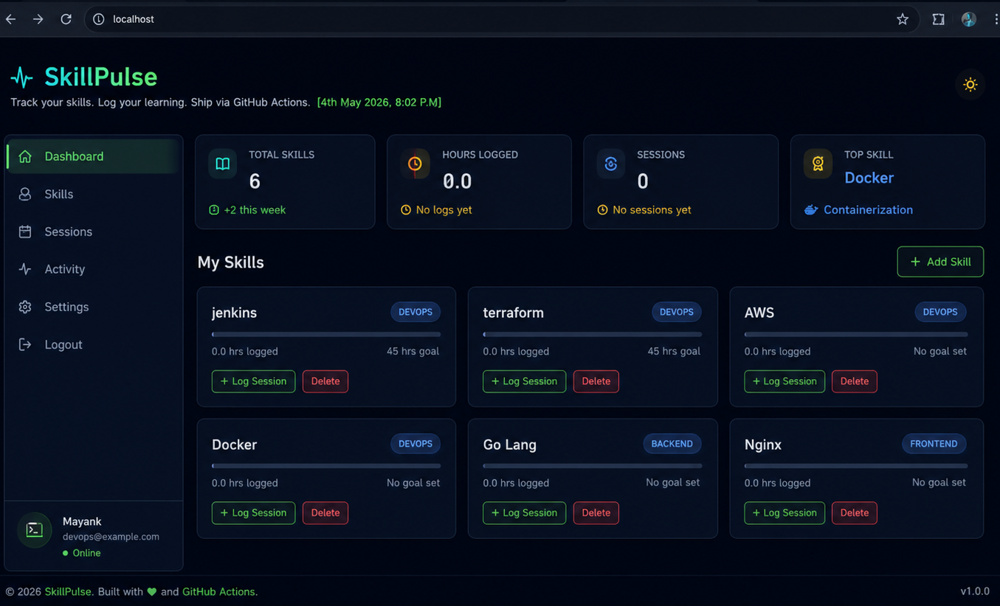

### Stop or reset

```bash
docker compose down
```

```bash
docker compose down --remove-orphans --volumes
docker rm -f $(docker ps -aq) 2>/dev/null || true
docker compose up -d --build
```

## GitHub Actions CI

The CI workflow runs on pushes to `main` and performs these stages:

```text
Checkout → Docker Buildx → Docker Hub Login → Build Backend → Build Frontend → Push Images
```

Recommended tags:

```text
<username>/skillpulse-backend:latest
<username>/skillpulse-backend:<run-number>
<username>/skillpulse-frontend:latest
<username>/skillpulse-frontend:<run-number>
```

```yaml
name: CI Workflow

on:
  push:
    branches: [main]
    paths-ignore:
      - 'k8s/**'
      - 'docs/**'

jobs:
  build-and-push:
    runs-on: ubuntu-latest
    steps:
      - uses: actions/checkout@v4
      - uses: docker/setup-buildx-action@v3
      - uses: docker/login-action@v3
        with:
          username: ${{ secrets.DOCKER_USERNAME }}
          password: ${{ secrets.DOCKER_PASSWORD }}
      - uses: docker/build-push-action@v6
        with:
          context: ./backend
          push: true
          tags: |
            ${{ secrets.DOCKER_USERNAME }}/skillpulse-backend:latest
            ${{ secrets.DOCKER_USERNAME }}/skillpulse-backend:${{ github.run_number }}
      - uses: docker/build-push-action@v6
        with:
          context: ./frontend
          push: true
          tags: |
            ${{ secrets.DOCKER_USERNAME }}/skillpulse-frontend:latest
            ${{ secrets.DOCKER_USERNAME }}/skillpulse-frontend:${{ github.run_number }}
```

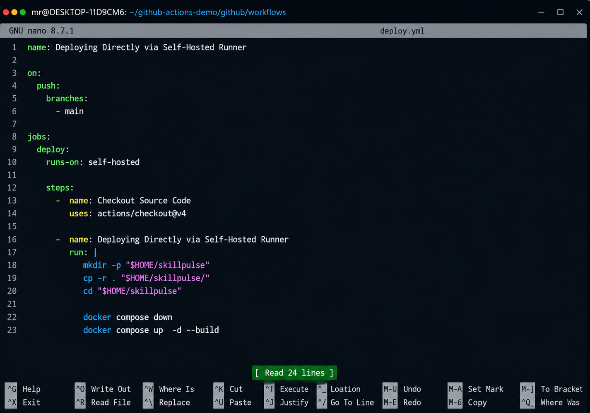

Required repository secrets:

| Secret | Purpose |
|---|---|
| `DOCKER_USERNAME` | Docker Hub username |
| `DOCKER_PASSWORD` | Docker Hub access token |
| `DEPLOY_ENABLED` | Optional deployment feature flag |

## CD with a Self-Hosted Runner

Register the runner from **Repository Settings → Actions → Runners** and use GitHub's generated installation commands.

Start it interactively:

```bash
cd actions-runner
./run.sh
```

Install it as a service:

```bash
sudo ./svc.sh install
sudo ./svc.sh start
sudo ./svc.sh status
```

Fix deployment-directory permissions when required:

```bash
sudo chown -R mr:mr /HOME/mr/skillpulse/
sudo chmod -R 755 /HOME/mr/skillpulse/
```

Example CD workflow:

```yaml
name: CD Workflow

on:
  workflow_run:
    workflows: ["CI Workflow"]
    types: [completed]

jobs:
  deploy:
    if: ${{ github.event.workflow_run.conclusion == 'success' }}
    runs-on: self-hosted
    steps:
      - uses: actions/checkout@v4
      - name: Deploy via self-hosted runner
        run: |
          mkdir -p "$HOME/skillpulse"
          rsync -avz --exclude '.git' ./ "$HOME/skillpulse/"
          cd "$HOME/skillpulse"
          docker compose down --remove-orphans --volumes
          docker rm -f $(docker ps -aq) 2>/dev/null || true
          docker compose up -d --build
```

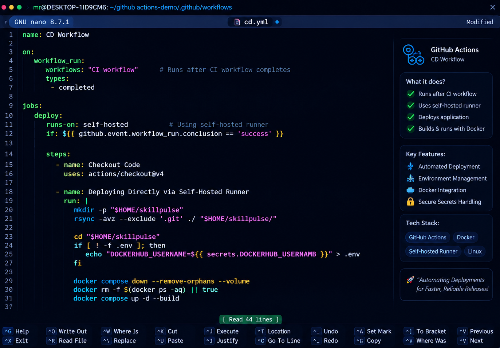

Successful output:

```text
Connected to GitHub
Listening for Jobs
Running job: deploy
Job deploy completed with result: Succeeded
```

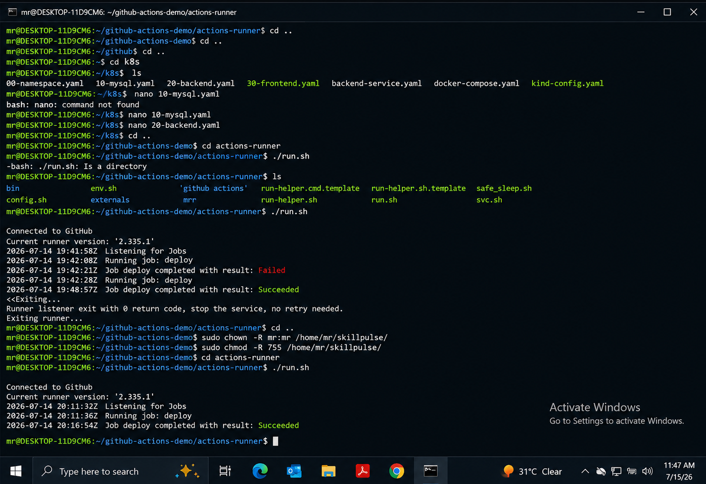

## Kubernetes Deployment with KinD

### Manifest order

| File | Purpose |
|---|---|
| `00-namespace.yaml` | Creates the `skillpulse` namespace |
| `10-mysql.yaml` | MySQL Secret/ConfigMap, Service, and StatefulSet |
| `20-backend.yaml` | Backend Deployment and Service |
| `30-frontend.yaml` | Frontend Deployment and NodePort Service |
| `backend-service.yaml` | Separate backend Service definition when used |
| `kind-config.yaml` | KinD cluster configuration |
| `docker-compose.yml` | Local deployment file; do not apply with kubectl |

### Create the cluster

```bash
kind create cluster --name skillpulse --config k8s/kind-config.yaml
kubectl cluster-info --context kind-skillpulse
kubectl get nodes
```

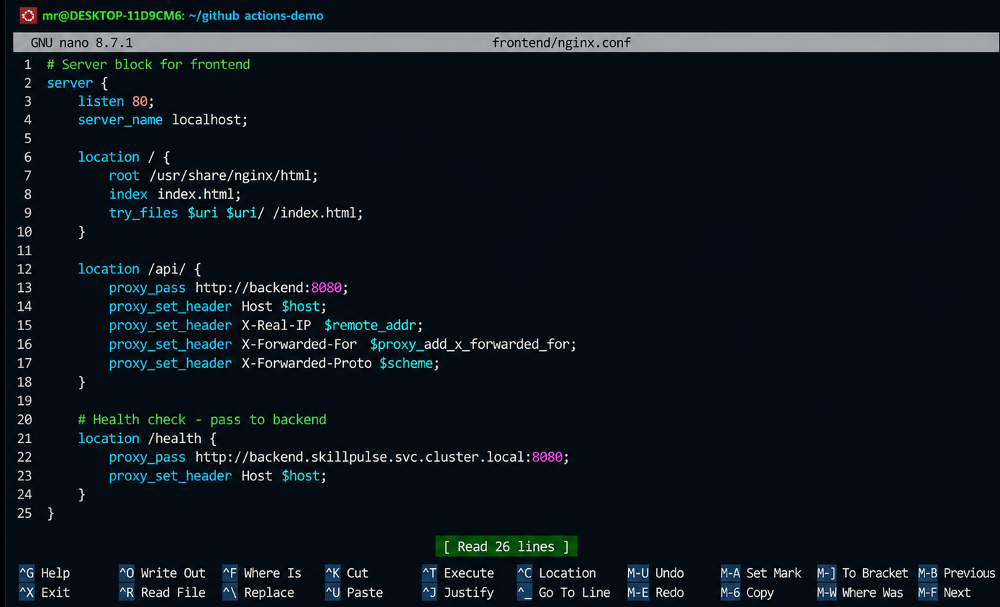

### Build and load local images

```bash
docker build -t your-user/skillpulse-backend:latest ./backend
docker build -t your-user/skillpulse-frontend:latest ./frontend
kind load docker-image your-user/skillpulse-backend:latest --name skillpulse
kind load docker-image your-user/skillpulse-frontend:latest --name skillpulse
```

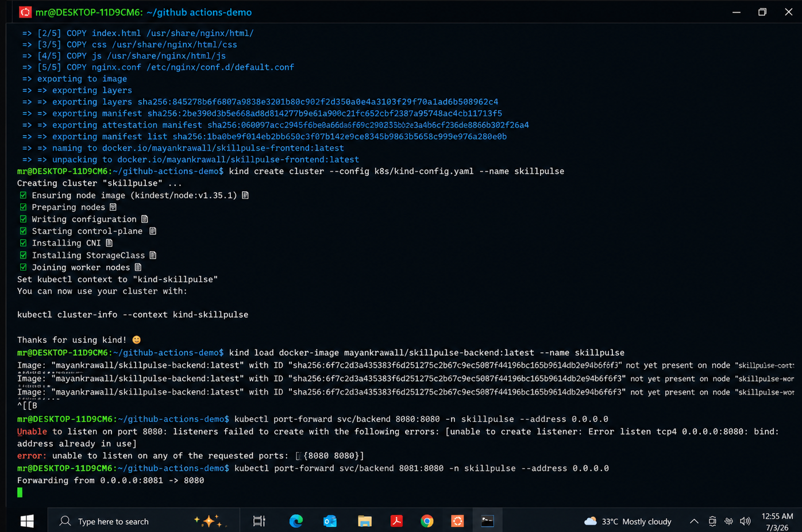

### Apply manifests

```bash
kubectl apply -f k8s/00-namespace.yaml
kubectl apply -f k8s/10-mysql.yaml
kubectl apply -f k8s/20-backend.yaml
kubectl apply -f k8s/30-frontend.yaml
```

Or apply the Kubernetes manifests while excluding non-Kubernetes files:

```bash
kubectl apply -f k8s/00-namespace.yaml \
  -f k8s/10-mysql.yaml \
  -f k8s/20-backend.yaml \
  -f k8s/30-frontend.yaml
```

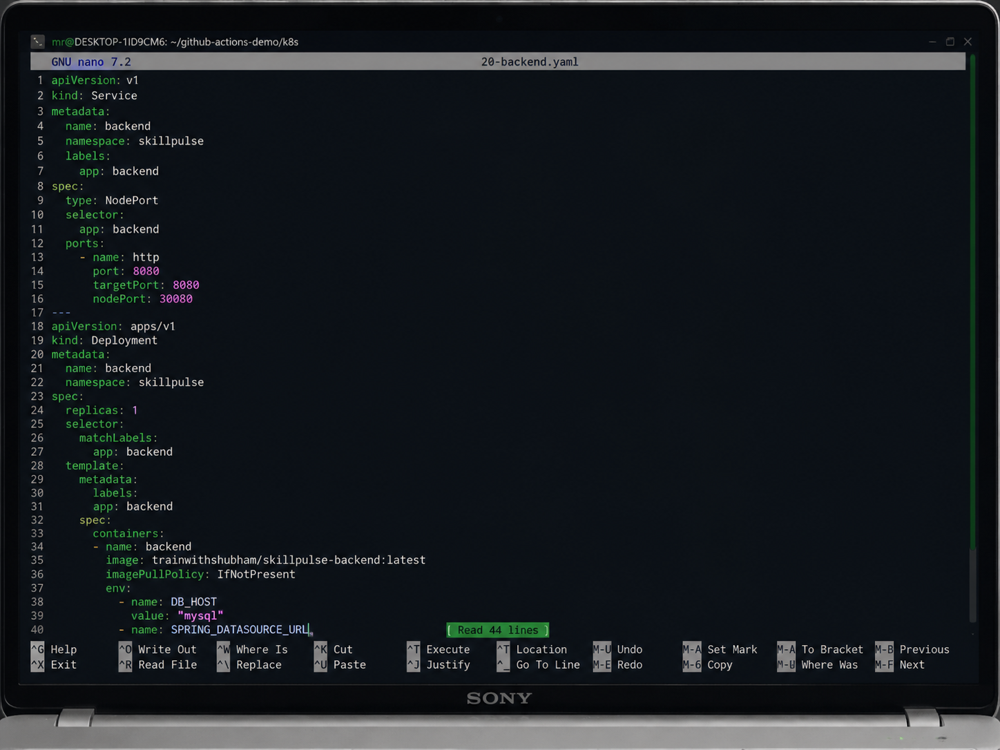

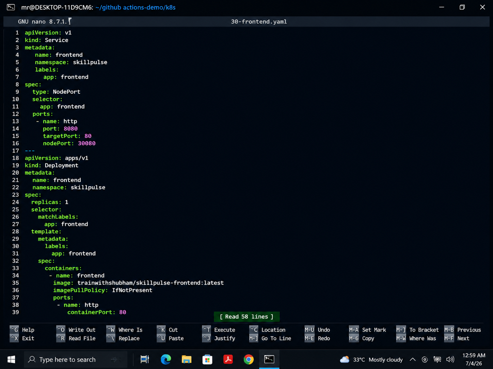

### Verify resources

```bash
kubectl get all -n skillpulse
kubectl get pods -n skillpulse -o wide
kubectl get svc -n skillpulse
kubectl rollout status deployment/backend -n skillpulse
kubectl rollout status deployment/frontend -n skillpulse
```

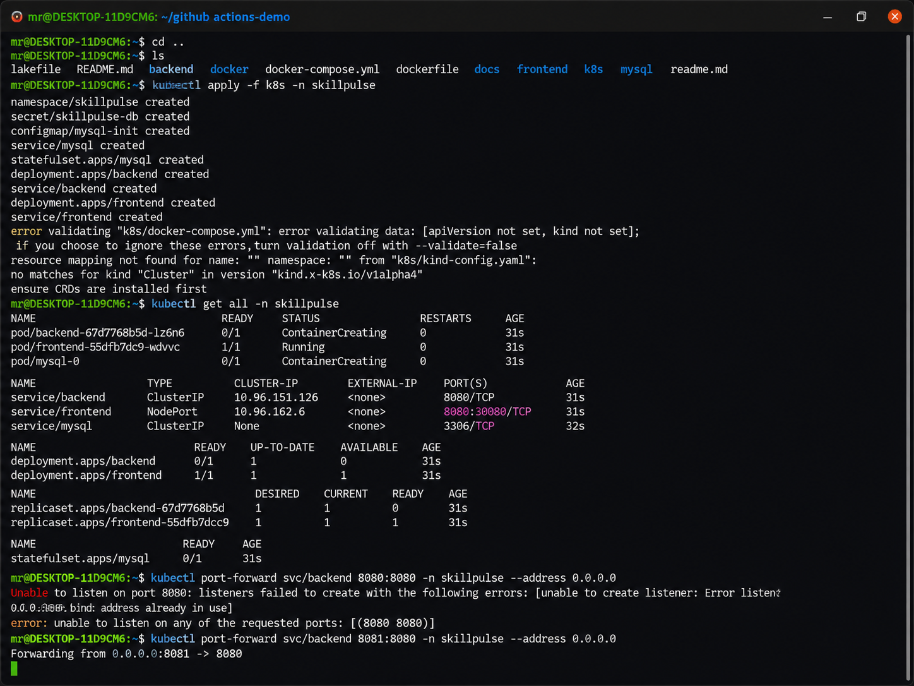

### Access the application

Frontend port-forward:

```bash
kubectl port-forward svc/frontend 3000:80 -n skillpulse --address 0.0.0.0
```

Open:

```text
http://localhost:3000
```

Backend port-forward for API testing:

```bash
kubectl port-forward svc/backend 8081:8080 -n skillpulse --address 0.0.0.0
```

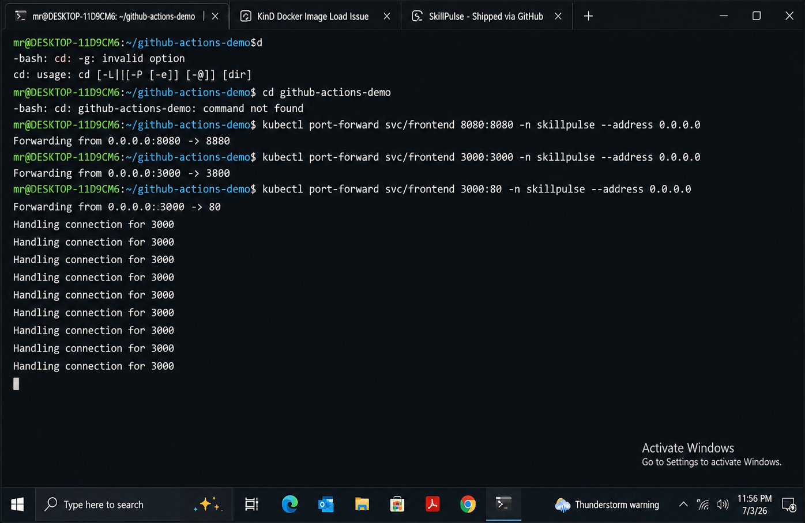

## Nginx Reverse Proxy

The frontend serves static files and proxies API requests to the backend Kubernetes Service.

```nginx
server {
    listen 80;
    server_name localhost;

    location / {
        root /usr/share/nginx/html;
        index index.html;
        try_files $uri $uri/ /index.html;
    }

    location /api/ {
        proxy_pass http://backend:8080;
        proxy_set_header Host $host;
        proxy_set_header X-Real-IP $remote_addr;
        proxy_set_header X-Forwarded-For $proxy_add_x_forwarded_for;
        proxy_set_header X-Forwarded-Proto $scheme;
    }
}
```

Inside Kubernetes, the backend can also be addressed through its fully qualified service name:

```text
backend.skillpulse.svc.cluster.local:8080
```

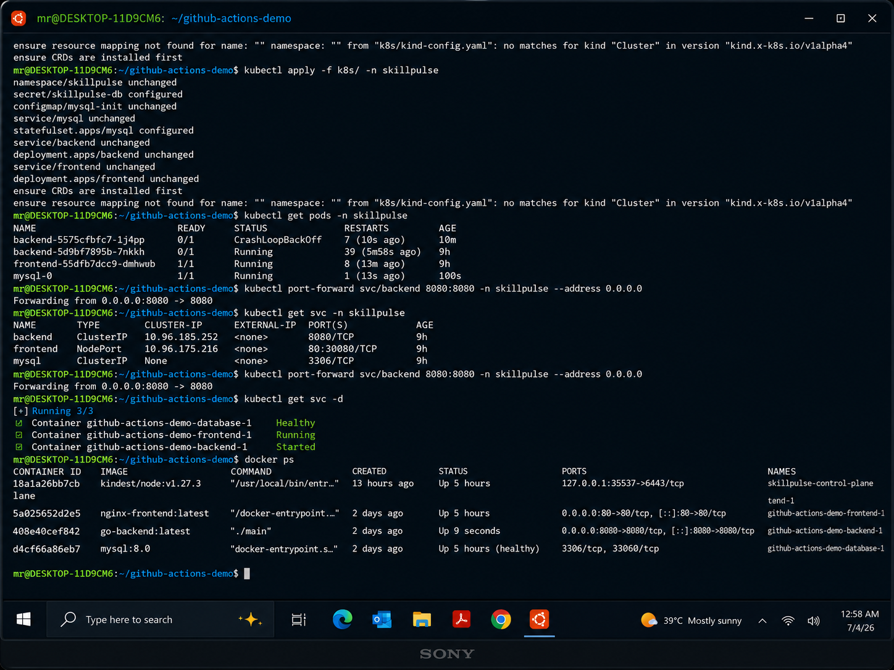

## Troubleshooting Guide

### Namespace not found

```text
namespaces "skillpulse" not found
```

Fix:

```bash
kubectl apply -f k8s/00-namespace.yaml
kubectl apply -f k8s/10-mysql.yaml
kubectl apply -f k8s/20-backend.yaml
kubectl apply -f k8s/30-frontend.yaml
```

### Invalid files passed to kubectl

`docker-compose.yml` and `kind-config.yaml` are not application manifests. Applying the entire directory may produce errors such as `apiVersion not set` or `no matches for kind Cluster`.

Use explicit manifest files instead of:

```bash
kubectl apply -f k8s/
```

### Port already in use

```text
Unable to listen on port 8080: address already in use
```

Find the process:

```bash
sudo lsof -i :8080
sudo ss -ltnp | grep :8080
```

Use another host port:

```bash
kubectl port-forward svc/backend 8081:8080 -n skillpulse
```

### Backend CrashLoopBackOff

```bash
kubectl get pods -n skillpulse
kubectl describe pod <backend-pod> -n skillpulse
kubectl logs deployment/backend -n skillpulse --tail=100
kubectl logs <backend-pod> -n skillpulse --previous
```

### MySQL access denied

```text
Error 1045 (28000): Access denied for user
```

Confirm that MySQL and backend use matching credentials:

```bash
kubectl get secret -n skillpulse
kubectl describe deployment backend -n skillpulse
kubectl logs statefulset/mysql -n skillpulse
```

After correcting configuration:

```bash
kubectl rollout restart deployment/backend -n skillpulse
kubectl rollout status deployment/backend -n skillpulse
```

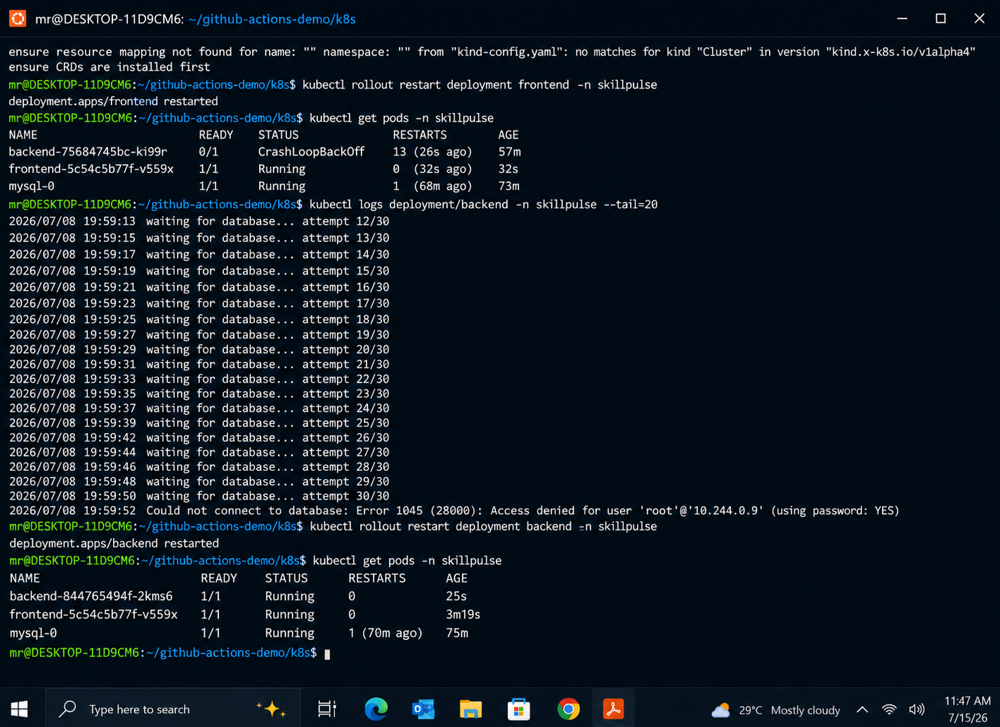

### ImagePullBackOff with local images

```bash
kind load docker-image your-user/skillpulse-backend:latest --name skillpulse
kind load docker-image your-user/skillpulse-frontend:latest --name skillpulse
kubectl rollout restart deployment/backend deployment/frontend -n skillpulse
```

Use `imagePullPolicy: IfNotPresent` for images loaded directly into KinD.
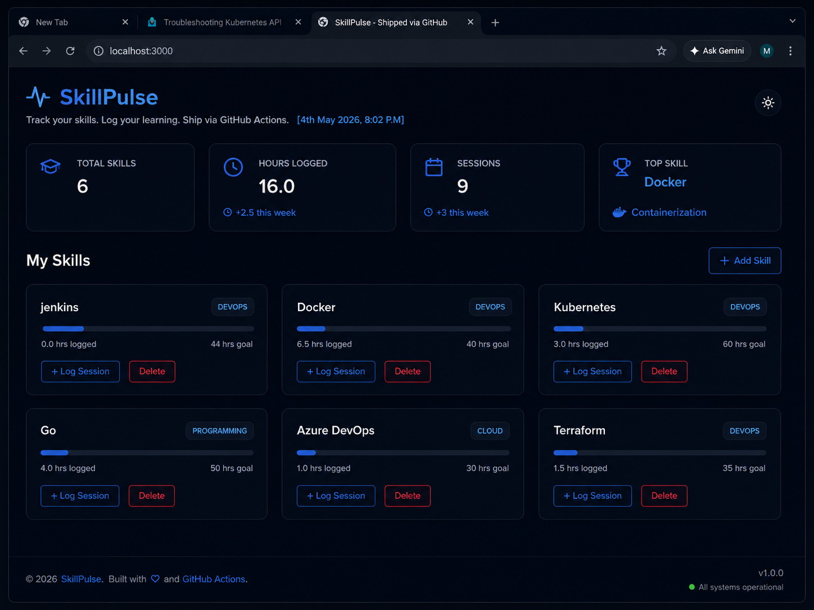
## Useful Operational Commands

```bash
kubectl get events -n skillpulse --sort-by=.metadata.creationTimestamp
kubectl top pods -n skillpulse
kubectl exec -it mysql-0 -n skillpulse -- mysql -uroot -p
kubectl exec -it deployment/backend -n skillpulse -- sh
kubectl rollout restart deployment/backend -n skillpulse
kubectl rollout restart deployment/frontend -n skillpulse
```

## Security Improvements for Production

- Store credentials in GitHub Secrets and Kubernetes Secrets.
- Use Docker Hub access tokens instead of account passwords.
- Pin container image versions instead of relying only on `latest`.
- Run containers as non-root users.
- Configure resource requests and limits.
- Add readiness and liveness probes.
- Use persistent volumes and a backup plan for MySQL.
- Place HTTPS ingress or a cloud load balancer in front of the application.
- Add vulnerability scanning and dependency checks to CI.
- Replace local KinD with a managed cluster for production workloads.

## Cleanup

```bash
kubectl delete namespace skillpulse
kind delete cluster --name skillpulse
docker compose down --remove-orphans --volumes
```

## Project Highlights for Resume

> Built and automated a three-tier application using Go, Nginx, MySQL, Docker, GitHub Actions, a self-hosted runner, and Kubernetes on KinD. Implemented container image CI, automated CD, Kubernetes service discovery, environment configuration, health checks, and systematic troubleshooting of port conflicts, image loading, CrashLoopBackOff, and database authentication failures.

## Author

**Mayank Rawal**  
DevOps & Cloud Engineering Learner

---

⭐ Star the repository if this project helps you understand a real end-to-end DevOps workflow.


---

# 📸 Additional Implementation Screenshots

## Docker Compose Configuration
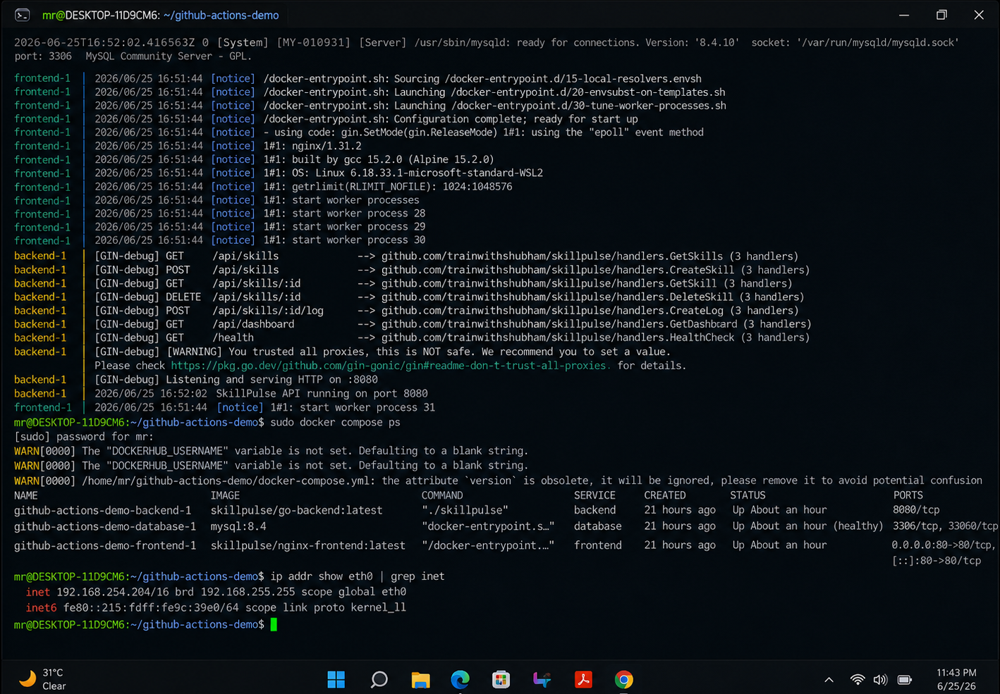

This screenshot demonstrates the production-ready `docker-compose.yml` configuration containing the **Go Backend**, **Nginx Frontend**, and **MySQL Database** services with health checks, restart policies, environment variables, and port mappings.

---

## Database Initialization

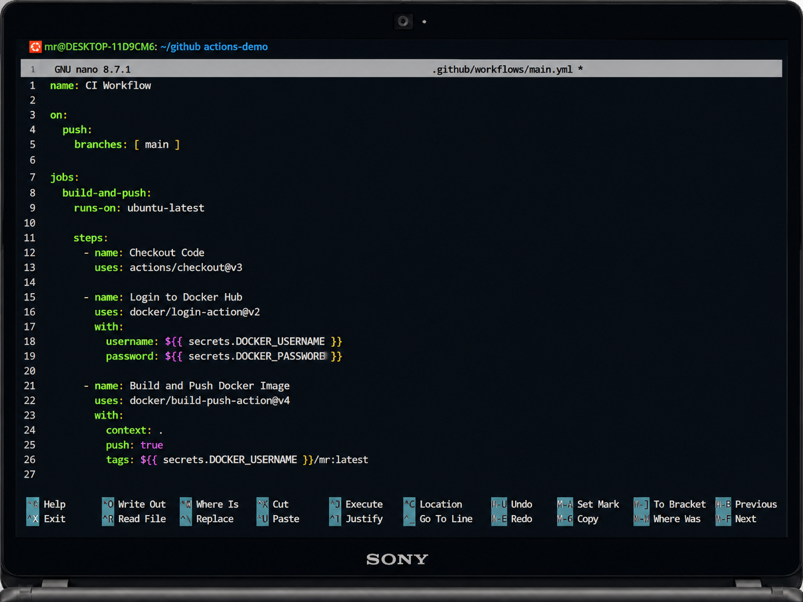

The MySQL schema was imported successfully using `init.sql`, and the required tables were verified.

---

## GitHub Actions Workflow

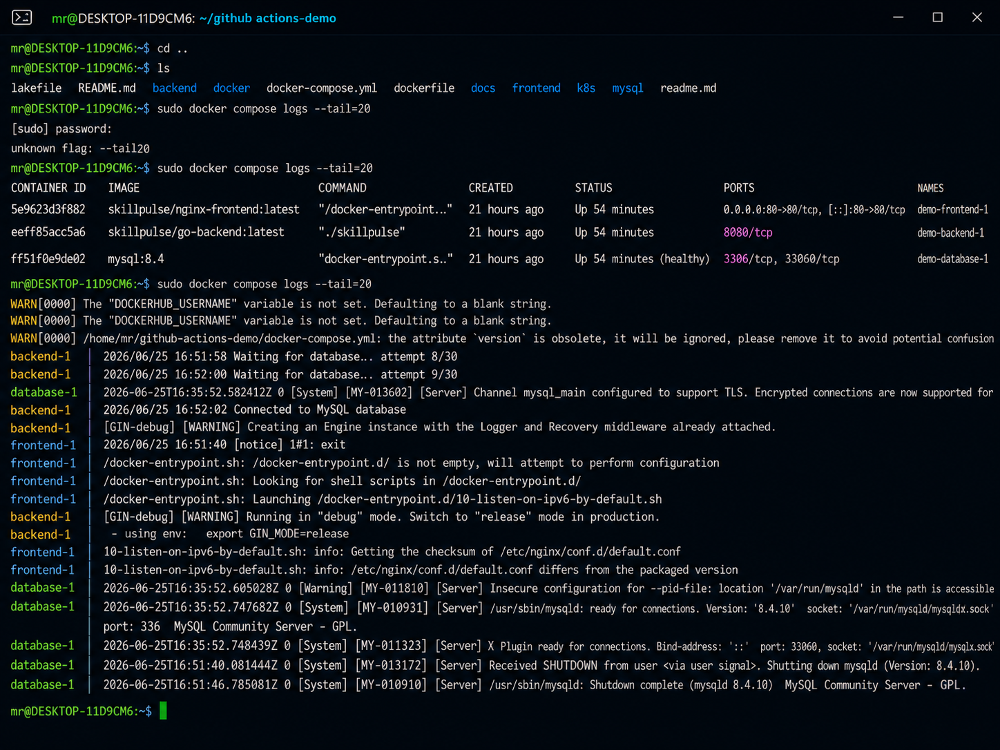

The CI workflow automatically builds and pushes Docker images after every push to the `main` branch.

---

## Docker Logs & Container Verification

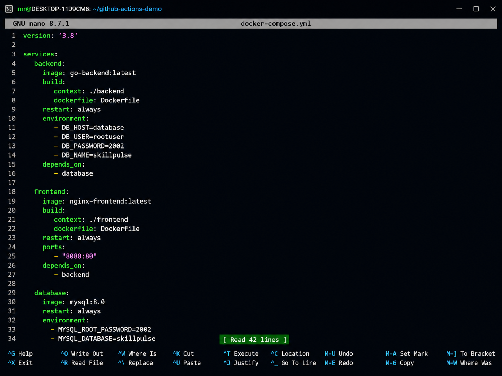

Container logs were verified to ensure all services were healthy and communicating correctly.

---

## Networking Verification

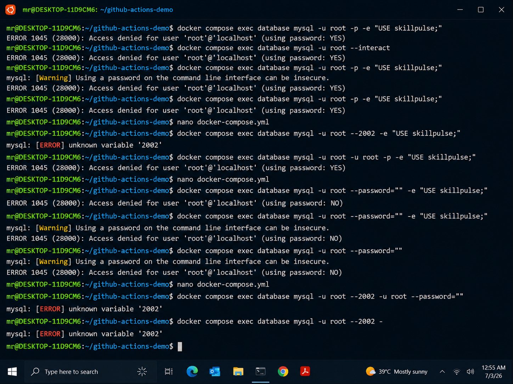

Verified container networking and exposed application IP for testing.

---

## Troubleshooting

During development the following issues were resolved:

- Incorrect Docker build context.
- MySQL authentication errors.
- Database initialization failures.
- Docker Compose warnings.
- Container startup dependency issues.
- Image build validation.
